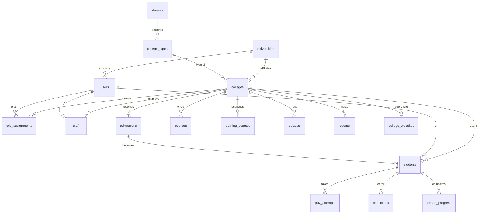
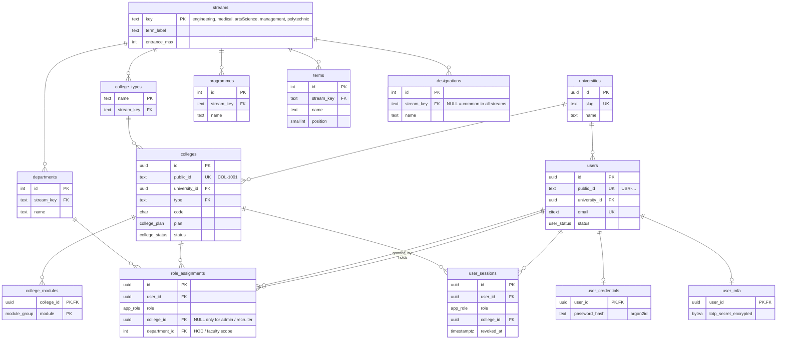
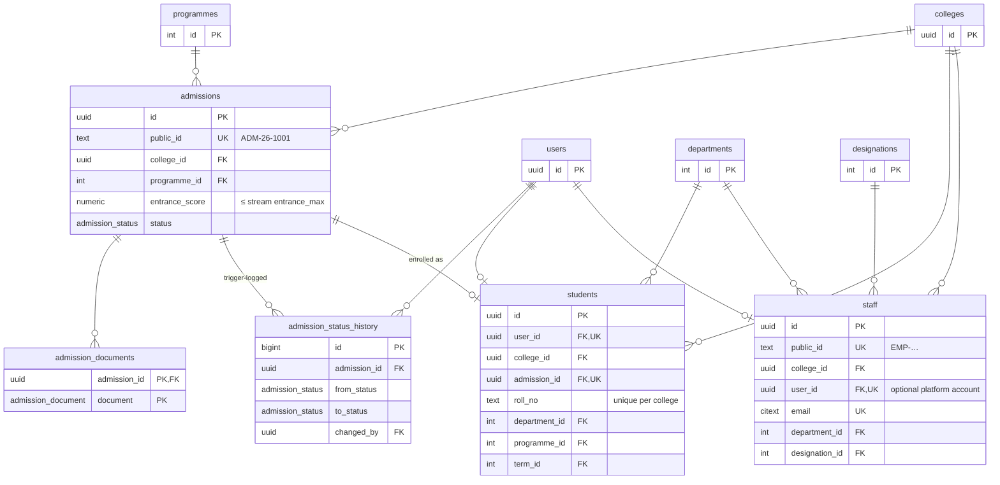
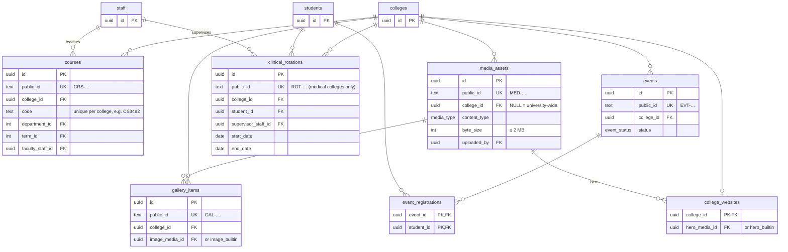
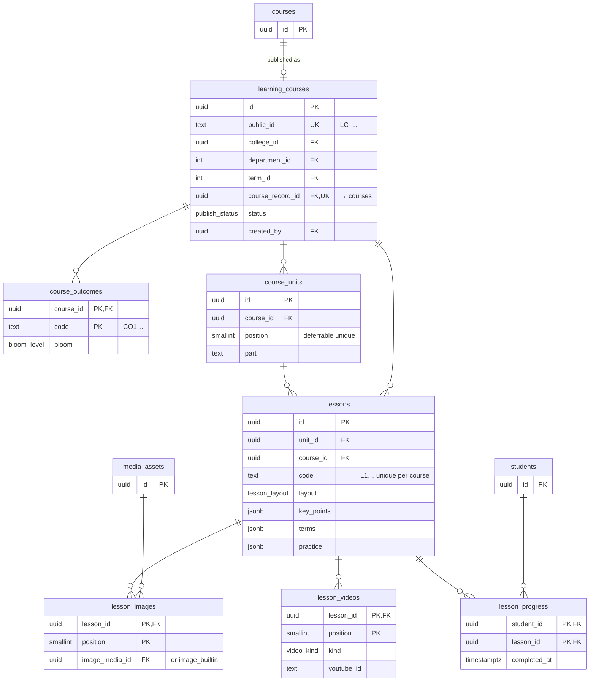
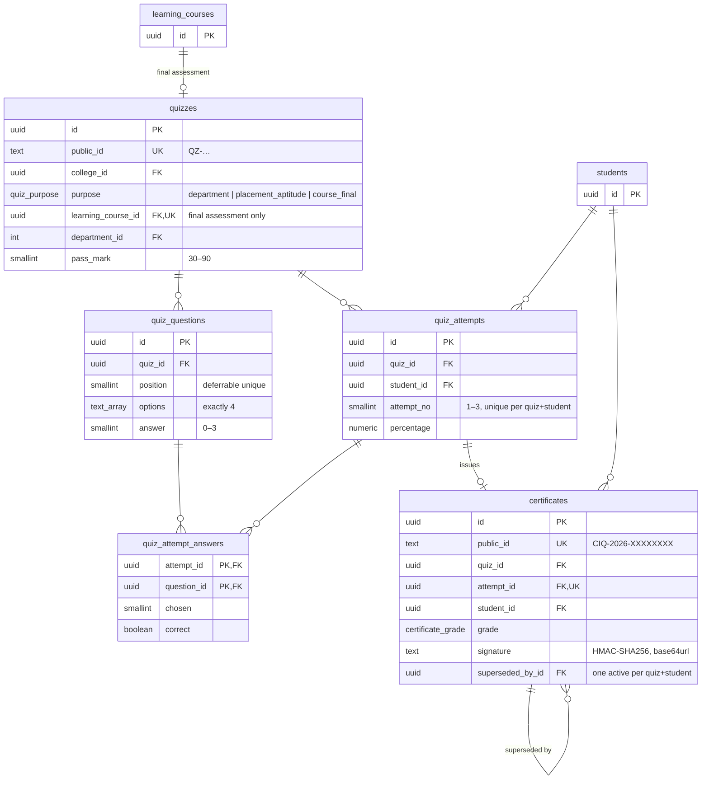
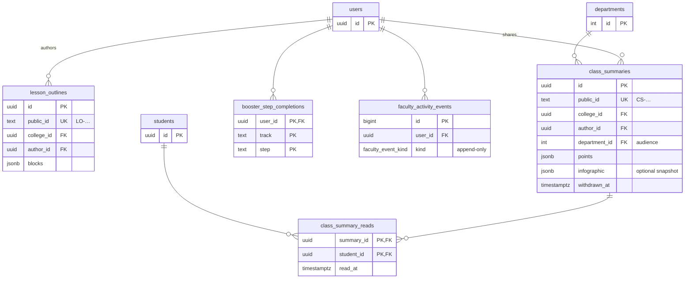
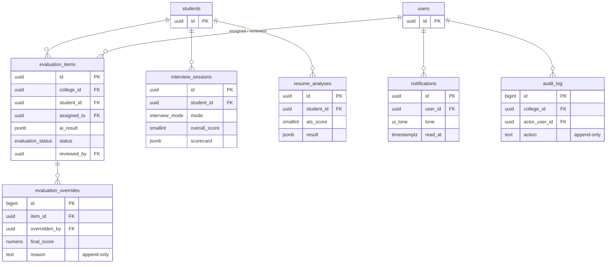

# CollossusIQ — entity-relationship diagrams

Source of truth: [`db/migrations/0001_init.sql`](../../db/migrations/0001_init.sql). Column-level detail is in the
[data dictionary](data-dictionary.md). The diagrams are split by domain; each shows keys and the columns that matter for
relationships. `colleges`, `users` and `students` appear in several diagrams as the shared anchors.

Legend: `||--o{` one-to-many · `||--o|` one-to-zero-or-one · `}o--||` many-to-one.

## 1. Overview

## 2. Tenancy, lookups and identity

## 3. People and admissions

## 4. Campus records and media

## 5. Learning — AI Course Studio and My Courses

## 6. Assessment and certificates

## 7. Teaching tools

## 8. Evaluation, career and platform

The view **`v_placement_readiness`** (one row per student) combines `quiz_attempts`, `certificates`,
`interview_sessions` and `resume_analyses`; see the data dictionary for its formula.
